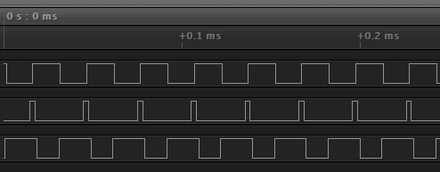

# UcnBrushlessDCMotorPWM

Arduino library that drives brushless DC motor like servo motor.

- Arduino library
- Drive brushless DC motor with ATMEGA328P, ESP32, ESP8266
- Support multiple motors with one MPU
- Support continuous rotation
- Support rotation with angle
- Triple PWM output with sin curve




## Support MPU
- ATMEGA328P
	- Dual motors support
	- 31KHz PWM frequency
- ESP32
	- Multiple motors support
	- High PWM frequency
- ESP8266
	- Multiple motors support
	- Low PWM frequency
	- NOT recommended

## Support Motor driver
- [L298N](http://s.click.aliexpress.com/e/_d6YWPqk) cheap([price $1.5](http://s.click.aliexpress.com/e/_d6YWPqk)) driver
	- Dual Full-Bridge driver IC
	- Maximum drive current is 4A(total), 3A(peak) or 2A(continuous)
	- Logic supply voltage 5V
	- Motor voltage support 46V(max)
- [DRV8313](http://s.click.aliexpress.com/e/_d6fRu7w) cheap([price $1](http://s.click.aliexpress.com/e/_d6fRu7w)) driver
	- Three Half-H-Bridge driver IC  
	- Maximum drive current is 2.5A(peak) or 1.75A(RMS)  
	- Logic voltage support 3.3V and 5V  
	- Motor voltage support 65V(max)  
- MOS-FET switch
- etc

# Install

## Library manager
Arduino IDE with using library manager.

1. Select [Sketch -> Include Library -> Manage Libraries...] to open library manager.
2. Search "UcnBrushlessDCMotorPWM" in library manager.
3. Select and install this library.

## Manual install

1. Download latest zip library from [here](https://github.com/usefullcodenet/UcnBrushlessDCMotorPWM/releases)
2. Select [Sketch -> Include Library -> Add .ZIP Library...]
3. Select and install downloaded library.


# Connection example

## [L298N](http://s.click.aliexpress.com/e/_d6YWPqk)

- withoout L298N enable pin

```
	Arduino UNO 9pin     ->    L298N modle IN1
	Arduino UNO 10pin    ->    L298N modle IN2
	Arduino UNO 11pin    ->    L298N modle IN3

	L298N modle OUT1     ->    BLDC motor U
	L298N modle OUT2     ->    BLDC motor V
	L298N modle OUT3     ->    BLDC motor W

	mobile battery 5V    ->    L298N modle 5V
	mobile battery 5V    ->    L298N modle VIN
	mobile battery GND   ->    L298N modle GND

	mobile battery GND   ->    Arduino UNO GND

	*L298N modle ENA/ENB jumpers are closed
```

- with L298N enable pin
```
	Arduino UNO 9pin     ->    L298N modle IN1
	Arduino UNO 10pin    ->    L298N modle IN2
	Arduino UNO 11pin    ->    L298N modle IN3

	Arduino UNO 4pin     ->    L298N modle ENA
	Arduino UNO 5pin     ->    L298N modle ENB

	L298N modle OUT1     ->    BLDC motor U
	L298N modle OUT2     ->    BLDC motor V
	L298N modle OUT3     ->    BLDC motor W

	mobile battery 5V    ->    L298N modle 5V
	mobile battery 5V    ->    L298N modle VIN
	mobile battery GND   ->    L298N modle GND

	mobile battery GND   ->    Arduino UNO GND

	*L298N modle ENA/ENB jumpers are open
```


## [DRV8313](http://s.click.aliexpress.com/e/_d6fRu7w)
```
	Arduino UNO 9pin     ->    DRV8313 IN1
	Arduino UNO 10pin    ->    DRV8313 IN2
	Arduino UNO 11pin    ->    DRV8313 IN3

	Arduino UNO 4pin     ->    DRV8313 EN1
	Arduino UNO 5pin     ->    DRV8313 EN2
	Arduino UNO 6pin     ->    DRV8313 EN3

	DRV8313 OUT1         ->    BLDC motor U
	DRV8313 OUT2         ->    BLDC motor V
	DRV8313 OUT3         ->    BLDC motor W

	mobile battery 5V    ->    DRV8313 VM
	mobile battery GND   ->    DRV8313 GND

	mobile battery GND   ->    Arduino UNO GND
```


## FET switch


# Basic usage

## Setup

```c
#include <UcnBrushlessDCMotorPWM.h>


UcnBrushlessDCMotorPWM _bldc;

//PWM output pin for BLDC driver
#define BLDC_DRV_IN1	9
#define BLDC_DRV_IN2	10
#define BLDC_DRV_IN3	11

//(option) ENABLE pin for BLDC driver
#define BLDC_DRV_EN1	4
#define BLDC_DRV_EN2	5
#define BLDC_DRV_EN3	6

//Pole count of BLDC motor
#define BLDC_MOTOR_POLE		14	//12N14P
//#define BLDC_MOTOR_POLE	22	//24N22P
//#define BLDC_MOTOR_POLE	26	//24N26P
//#define BLDC_MOTOR_POLE	28	//24N28P
//#define BLDC_MOTOR_POLE	32	//24N32P


void setup()
{
	_bldc.begin(BLDC_MOTOR_POLE, BLDC_DRV_IN1, BLDC_DRV_IN2, BLDC_DRV_IN3, BLDC_DRV_EN1, BLDC_DRV_EN2, BLDC_DRV_EN3);

	_bldc.SetPower(80);		//motor power 80%
}
```


## Drive like as slow DC motor

```c
void loop()
{
	// continuos rotation
	_bldc.DoRotate(1);
	delayMicroseconds(3000);
}
```


## Drive like as servo motor

```c
void loop()
{
	//180 degree rotation with 3000 usec delay loop
	_bldc.DoRotateLoop(180, 3000);
	
	//180 degree inverse rotation with 3000 usec delay loop
	_bldc.DoRotateLoop(-180, 3000);
}
```

# Available PWM pin

## Arduino UNO(ATMEGA328P)
- 3 pin
- 5 pin
- 6 pin
- 9 pin
- 10 pin
- 11 pin


## ESP32
- GPIO 0
- GPIO 2
- GPIO 4
- GPIO 12 to 15
- GPIO 25 to 27
- GPIO 32 to 33
- A4 to A5
- A10 to A19


## ESP8266
- GPIO 0 to GPIO 5
- GPIO 12 to GPIO 16
	- GPIO 6 to 11 are reserved for flash memory
	- attention: ex. "D1" means NOT "GPIO 1"

# ATTENTION

The brushless DC motor needs a large current. Be sure to use ampere meter.  
Mobile battery with built-in safety circuit is recommended for the motor power supply, and [USB current meter](http://s.click.aliexpress.com/e/_dZpiddS) is useful.


# Download

Download release version from [here](https://github.com/usefullcodenet/UcnBrushlessDCMotorPWM/releases)

# License
MIT

